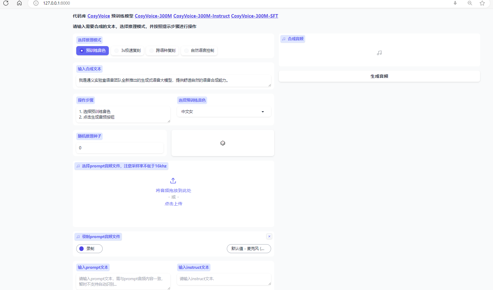

## 🎪 项目介绍

这是一个AI面试官项目，通过深度集成 **多模态AI技术**（语音识别+语音合成+数字人生成+大语言模型），构建了高度拟人化的虚拟面试官。系统可模拟真实面试场景，为求职者提供沉浸式面试体验，同时帮助企业高效筛选人才。核心功能参考了如 **[商业平台](https://m.a2e.com.cn)**，并在技术实现上具备以下独特优势：

## 🛠️ 技术架构


## 🛠️ 主要数据库表关系


### 核心实体


### 数据流


## 🌈 创新亮点

### 语音生成/克隆

语音生成/克隆是使用的**[CosyVoice](https://github.com/FunAudioLLM/CosyVoice)**项目。**支持多种语言** ：中文、英文、日文、韩文、中国方言（广东话、四川话、上海话、天津话、武汉话等），实现低至 150 ms 的延迟，同时保持高质量的音频输出。发音错误减少了 30%至 50%

#### 语音生成数据集

```
#原神4.8语音包（中）
https://ai-studio-online.bj.bcebos.com/v1/db5264baa0064b82b2ac6a1aea28249a497c75bcc2c14a508eda4cfb202d753a?responseContentDisposition=attachment%3B%20filename%3D%E5%8E%9F%E7%A5%9E%E8%AF%AD%E9%9F%B3%E5%8C%854.8%EF%BC%88%E4%B8%AD%EF%BC%89.7z&authorization=bce-auth-v1%2F5cfe9a5e1454405eb2a975c43eace6ec%2F2024-07-16T02%3A39%3A19Z%2F-1%2F%2F4b4bb21e1e2fd1b410a2a7bf4ee22dbb5b3aa362fe0ba066fcd5ee5bdb4a7f65

#原神4.8语音包对应文本（中）
https://229fix-my.sharepoint.com/:x:/g/personal/rec_tvfix_org/EW9F_RA0435Lju80M3PvNTYBZLL3LZkn_LGgLpms8QYJFA?e=XDfHdt

#原神4.8语音包（日）
https://ai-studio-online.bj.bcebos.com/v1/0f3cda6c5b3e49b8965d68b0c91226310057958565e942788036e50ede6504c4?responseContentDisposition=attachment%3B%20filename%3D%E5%8E%9F%E7%A5%9E%E8%AF%AD%E9%9F%B3%E5%8C%854.8%EF%BC%88%E6%97%A5%EF%BC%89.7z&authorization=bce-auth-v1%2F5cfe9a5e1454405eb2a975c43eace6ec%2F2024-07-16T02%3A58%3A03Z%2F-1%2F%2Fee5ef6f050ade46f684295601dcdd9c1f5ad996787516a4aadcbbdce8e7c5521

#原神4.8语音包对应文本（日）
https://229fix-my.sharepoint.com/:x:/g/personal/rec_tvfix_org/EfAmY1R1D7NJjxyjjSNYf0cBHNzFRW1qfpT2VM-xtby85Q?e=TA4kso

#原神4.8语音包（英）
https://ai-studio-online.bj.bcebos.com/v1/14a5273d158c4a42b5c91404b152562e8e12bb5a518142b49cd4645c00b5977a?responseContentDisposition=attachment%3B%20filename%3D%E5%8E%9F%E7%A5%9E%E8%AF%AD%E9%9F%B3%E5%8C%854.8%EF%BC%88%E8%8B%B1%EF%BC%89.7z&authorization=bce-auth-v1%2F5cfe9a5e1454405eb2a975c43eace6ec%2F2024-07-16T02%3A57%3A59Z%2F-1%2F%2F82a580beecbf9b922d5eb575879f8c21020d27efc115eb65e1d01a6ca67fff8b

#原神4.8语音包对应文本（英）
https://229fix-my.sharepoint.com/:x:/g/personal/rec_tvfix_org/ETsddPHSZo1EtuXq_CFfsc4B_MhkfL_sYHPdH2fmqg2HPQ?e=LZfTKp

#原神4.8语音包（韩）
https://ai-studio-online.bj.bcebos.com/v1/0e1f7f7973664580b148778bff48dff64310433fcda04816879de604c6420938?responseContentDisposition=attachment%3B%20filename%3D%E5%8E%9F%E7%A5%9E%E8%AF%AD%E9%9F%B3%E5%8C%854.8%EF%BC%88%E9%9F%A9%EF%BC%89.7z&authorization=bce-auth-v1%2F5cfe9a5e1454405eb2a975c43eace6ec%2F2024-07-16T02%3A54%3A19Z%2F-1%2F%2F850aab9798464cf5395105e0dede1032f94220
```



### 数字人生成

数字人生成使用的是[easy-wav2lip](https://github.com/evenedge/easy-wav2lip)实现数字人的说话

### 对接AI大模型

这里我们用的智谱AI 因为这个平台有免费的API接口 我们这个用来学习基本用免费的就行了进入模型广场[glm-4](https://bigmodel.cn/dev/api/normal-model/glm-4 )进入其接口文档

### 语音转文字工具

[百度智能云页面认证](https://console.bce.baidu.com/ai-engine/speech/overview/index)点击快速接入服务 然后创建应用
